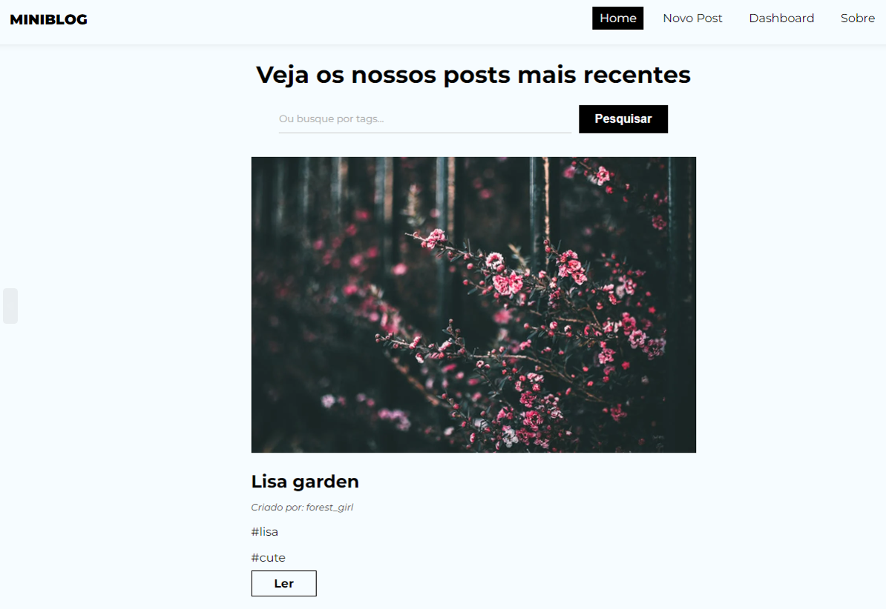

<h1 align="center" style="font-weight: bold;">Mini Blog 💻</h1>

<p align="center">
 <a href="#tech">Technologies</a> •
 <a href="#started">Getting Started</a> •
  <a href="#colab">Collaborators</a> •
 <a href="#contribute">Contribute</a>
</p>

<p align="center">
    <b>Este projeto é um miniblog simples onde os usuários podem compartilhar imagens, escrever pequenos comentários e adicionar hashtags aos seus posts. É uma plataforma minimalista que permite a interação básica e o compartilhamento de conteúdo visual e textual de forma rápida e fácil.</b>
</p>

<p align="center">
     <a href="https://appminiblog.netlify.app/">🔗 Live</a>
</p>

<p align="center"> Acesse com as credenciais:

<b align="center" >login:</b>
<span align="center" >teste@teste.com</span>
|
<b align="center" >password:</b>
<span align="center" >123456</span>

</p>

<h2 id="layout">🎨 Layout</h2>

<p align="center">
    
</p>

<h2 id="technologies">💻 Technologies</h2>

- React
- React-Router-dom
- React Hooks
- Firebase
- Tailwind CSS

<h2 id="started">🚀 Iniciando</h2>

Clone o repositório crie um arquivo `.env` e forneça seus valores assim como no arquivo `env.example`

<h3>Pré-requisitos</h3>

- [NodeJS](https://github.com/)
- [Git](https://github.com)
- [Firebase Accont + storage](https://firebase.google.com/docs/web/setup?hl=pt-br)

<h3>Clonando</h3>

Como clonar seu projeto:

```bash
git clone https://github.com/ivanfrancajunior/Miniblog.git
```

<h3>Iniciando</h3>

Como iniciar seu projeto:

```bash
cd miniblog
npm install
npm run dev
```
